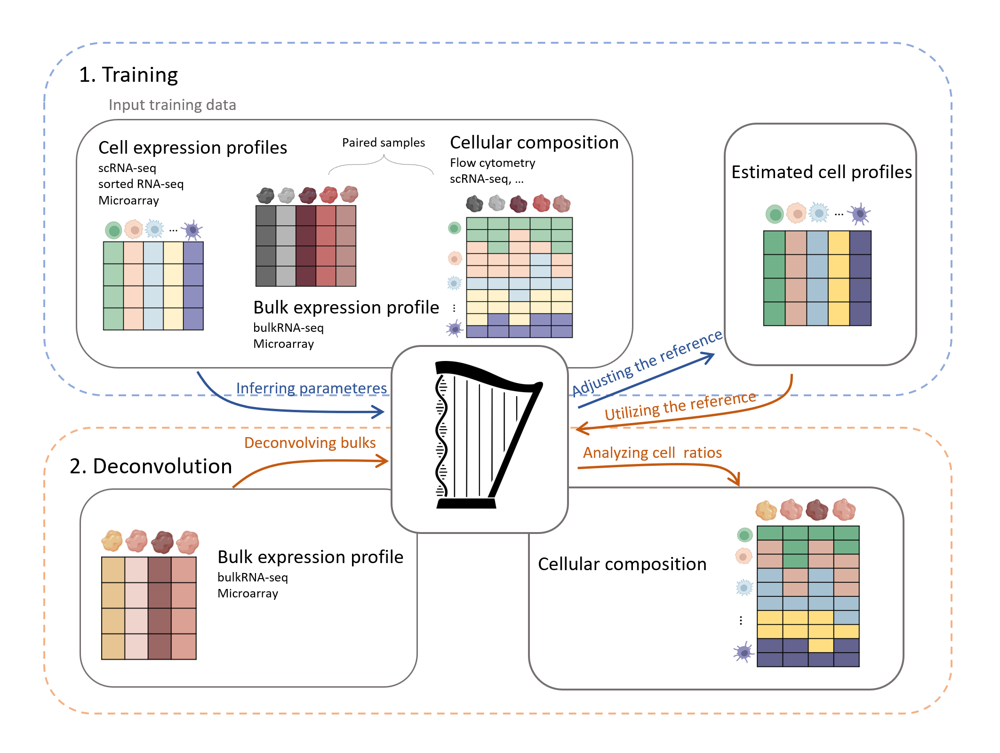

# harp

HARP is a computational method that improves tissue deconvolution accuracy by addressing both biological and technical inconsistencies in the data. The method harmonizes discrepancies between experimentally measured tissue compositions, deconvolution results, and reconstructed bulk profiles. This process leads to more reliable cell type proportion estimates for bulk tissue samples.


<div style="text-align: center">
    
</div>
<!-- 
For more  details, see [bioarxiv](). -->


## Install

1. Clone this repo
2. Start an `R` session from the repository root folder
3. Run following code snippet from within `R`
```R
library(devtools)
devtools::install_github("spang-lab/harp")
```
## Usage

The cell type proportions are estimated by the function `harp_deconvolution_model`. The main inputs are:

- `train_data`:  list of training data, including bulk gene expression samples and their corresponding cellular compositions.
- `cell_reference_profile`: matrix representing the averaged gene-wise expression profiles of different cell types.  
- `bulk_data`: matrix of bulk gene expression data that requires deconvolution. If this is set to `NULL`, only the reference is estimated.

The function `harp_deconvolution_model` provides output as a list  with the following elements:

- `harp_reference_profile`:  matrix representing the reference profile estimated by Harp.  
- `estimated_cell_composition`: matrix containing the cellular compositions of the `bulk_data`.  
- `harp_model`: list containing details of the training process.

### Input Data 

- `train_data`: list containing paired training bulk data, where:  
  - `mixtures` : matrix of expression values (`g x n`) with genes as rows and samples as columns , where row names represent gene names and column names represent sample names. 
  - `quantities`: matrix of cell proportions (`q x n` or `(q+1) x n`) with values in [0,1], where rows correspond to cell types (row names indicate cell types) and columns to samples (column names represent sample names). 
 If the sum of cell proportions in the samples is not equal to one, add an additional row named `extra` to account for unidentified cells, ensuring the total cell composition in each sample sums to one.

- `cell_reference_profile`: matrix representing the averaged gene-wise expression profiles of different cell types (`g x q ` or `g x (q+1)`). 
If an `extra` row is added in the `quantities` matrix,  include an additional column in the `cell_reference_profile` matrix. This new column should represent the gene average of the cell profiles that were not quantified in the `quantities` matrix.  

- `bulk_data`: matrix of gene expression that has `g` number of genes in the rows and samples that require deconvolution in its column, where row names are gene nemes and column names are samples names.

### Minimal working example

We provide the simulation scenario of our monograph also in the form of a minimal working example by directly including (downsampled) data in our package.
The data is comprised of the following studies:
- [Dissecting intratumour heterogeneity of nodal B-cell lymphomas at the transcriptional, genetic and drug-response levels](https://www.nature.com/articles/s41556-020-0532-x) by **[Roider et al., 2020]** accessible under [heiDATA ID VRJUNV](https://heidata.uni-heidelberg.de/dataset.xhtml?persistentId=doi:10.11588/data/VRJUNV) or [EGAS00001004335](https://ega-archive.org/studies/EGAS00001004335)
- [The landscape of tumor cell states and ecosystems in diffuse large B cell lymphoma](https://www.cell.com/cancer-cell/fulltext/S1535-6108(21)00451-7) by **[Steen et al., 2021]**, accessibly under [GSE182436](https://www.ncbi.nlm.nih.gov/geo/query/acc.cgi?acc=GSE182436) and [GSE182434](https://www.ncbi.nlm.nih.gov/geo/query/acc.cgi?acc=GSE182434)
The first dataset is used to generate artificial bulk mixtures with ground truth proportions by cumulating single cells.
The second dataset is used to construct a cell type-specific reference profile by averaging over single cells corresponding to each type respectively.

In order to see harp in action, simply source
```r
library(harp)

# Load input data (use help(data) for further description)
cell_reference_profile <- harp_data$cell_reference_profile
train_data <- harp_data$train_data
bulk_counts_test <- harp_data$bulk_counts_test

# infer proportions of HARP
output_harp <- harp_deconvolution_model(
    train_data = train_data,
    cell_reference_profile = cell_reference_profile,
    bulk_data = bulk_counts_test,
    verbose = TRUE,
)

# The harmonized reference profile
head(output_harp$harp_reference_profile)

# The inferred cell proportions of the trained model for the test bulk samples
output_harp$estimated_cell_composition
```


###  Visualization and Benchmark

We provide another package **harplication**, for showcasing harp in a vignette and reproducing the results of our papar.

**Harp: A Platform Independent Deconvolution Tool** by\
Zahra Nozari, Paul Hüttl, Jakob Simeth, Marian Schön, James.A. Hutchinson, Rainer Spang, 2025.

<!-- For preprint see [bioarxiv](). -->

